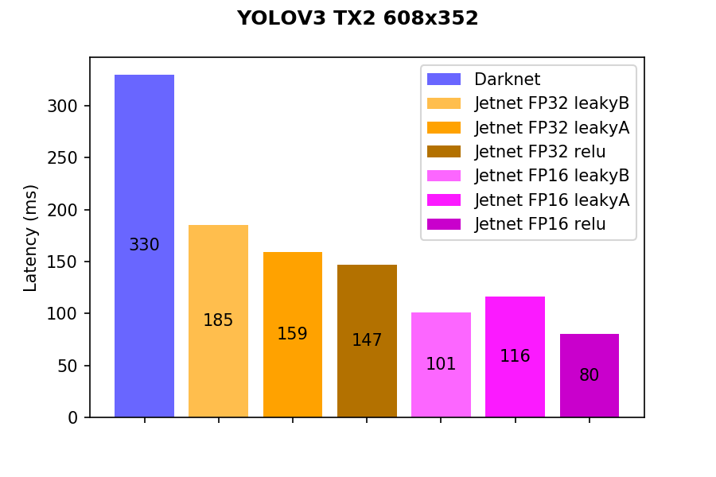

Jetnet is a blazing fast [TensorRT](https://developer.nvidia.com/tensorrt) implementation in C++ of

* YOLOV2
* YOLOV3
* tinyYOLOV3

## Performance

YOLOV3 performace benchmarks on Jetson TX2 and Jetson Xavier.




Test conditions:
* Batch size 1
* All optimizations enabled
* Input resolution of YOLOv3 is set to 608x352 (~16/9 aspect ratio)
* Measurements are averaged over 600 inference iterations
* Accuracy drops on all models compared to trained models in darknet < 0.5% mAP.
* Measurements are inference time only (without pre/post processing)
* leakyA, leakyB and relu prepresent three different activation implementations:
  * leakyA = plugin based leaky ReLU
  * leakyB = leaky ReLU built using a few native TensorRT layers
  * relu = YOLOV3 with standard ReLUs (needs retraining)

Pre and post processing (included in Jetnet) times are equal for all models given a specific target:

| PLATFORM             | Pre processing | Post processing |
|:---------------------|:---------------|:----------------|
| JETSON TX2           | 3.5 ms         | 0.8 ms          |
| JETSON Xavier        | 2.6 ms         | 0.6 ms          |

Preprocessing involves converting an opencv Mat object to a GPU input blob while
Postprocessing involves converting output tensors to detections + applying NMS.

## Building the code

Dependencies:

* cmake 3.8+
* TensorRT 3, 4 or 5
* OpenCV 3.X
* libboost-filesystem

Building:

```
mkdir build
cd build
cmake ..
make
```

Building in debug mode:

```
cmake -DCMAKE_BUILD_TYPE=Debug ..
make
```

Building with address sanitizer (memory sanity checking)

```
cmake -DWITH_ADDRESS_SANITIZER=true ..
make
```

Installing on your system (path set with -DCMAKE_INSTALL_PREFIX):

```
make install
```

You can compile other cmake based projects against jetnet using:

```
find_package(jetnet REQUIRED)
```

## Compiling a network

```
jetnet_build_darknet_model yolov3_leaky_plugin darknet_weights_file.weights out.model
```

For more options (quantization level, max batch size, input resolution):

```
jetnet_build_darknet_model --help
```

Building might take a while depending on the speed of your target and selected options

NOTE: if you did not install jetnet on your system, you will find the executables in the 'examples' folder inside
the build folder.

TODO: add more example command lines

## Running a compiled network

Run a compiled model on an image:

```
jetnet_run_yolo yolov3 out.model names_file.names input_image.jpg
```

Where names_file.names is a text file with the class labels supported by the network (same as used by darknet)

Validate a compiled model on a dataset to collect detections and measuring time performance:

```
jetnet_validate_yolo --profile yolov3 out.model names_file.names images.txt detections.json
```

Where images.txt is a file with images (one path per line) from the dataset and detections.json are the resulting detections in MS COCO format.

Again use --help for more options on these commands (batch size, thresholds, etc...)
